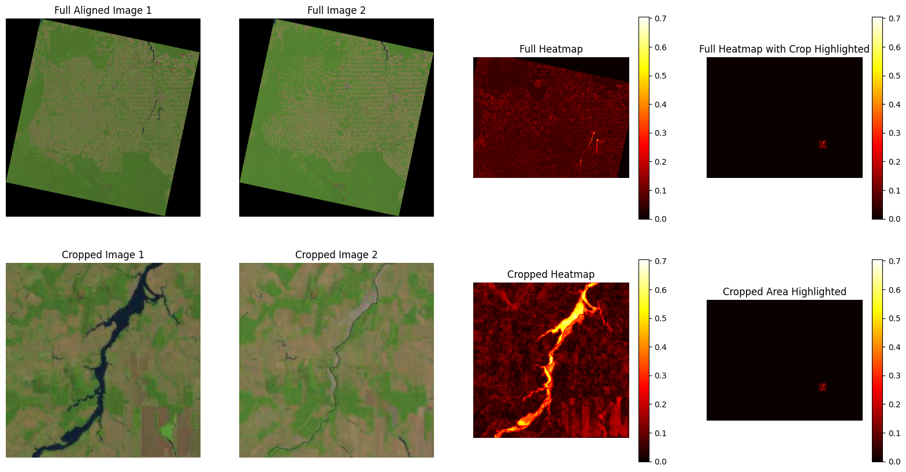

# Analiza Danych

## Wstęp

W ramach naszego projektu skupiliśmy się na analizie danych satelitarnych w celu zbadania zmian na powierzchni Ziemi. Początkowo wykorzystaliśmy obrazy z satelity Landsat 7, jednak ze względu na problemy z jakością i niedoskonałością zdjęć - patrz czarne paski po lewej i po prawej zdjęcia, zmieniliśmy podejście na obrazy z nowszego satelity Landsat 8. Oferuje ona zdjęcia od 2013 roku. Przeprowadziliśmy szczegółową analizę porównawczą tych zdjęć, aby ocenić zmiany zachodzące w badanym obszarze.

## Metodologia

### Wykorzystanie Landsat 7

Na początku projektu korzystaliśmy z obrazów Landsat 7, który dostarczał danych od 1999 roku. Satelita ten jest wyposażony w Enhanced Thematic Mapper Plus (ETM+). Naszym celem było przeanalizowanie zmian w wybranych latach. Niestety, napotkaliśmy istotne problemy związane z jakością danych. Największym problemem były czarne paski na pobranych obrazach.

### Przejście na Landsat 8

Ze względu na wspomniane trudności, zdecydowaliśmy się na wykorzystanie obrazów z satelity Landsat 8, uruchomionego w 2013 roku. Satelita ten jest wyposażony w Operational Land Imager (OLI) i Thermal Infrared Sensor (TIRS), co pozwoliło na uzyskanie bardziej szczegółowych i precyzyjnych danych. Obrazy z Landsat 8 nie miały problemu z czarnymi paskami, co znacznie ułatwiło naszą analizę.

### Próby Użycia Modeli Analizy Obrazów

Przed przejściem do bezpośredniego porównania zdjęć, podjęliśmy próby zastosowania różnych modeli analizy obrazów w celu automatyzacji procesu. Przetestowaliśmy takie modele jak ResNet 50, ResNet 101, YOLO v8, YOLO v9 oraz pięć innych modeli. Niestety, żaden z tych modeli nie przyniósł zadowalających wyników w kontekście analizy danych satelitarnych z Landsat. Modele miały trudności z dokładnym identyfikowaniem zmian w pokrywie terenu, co zmusiło nas do zmiany podejścia.

## Proces Analizy

1. **Zbieranie Danych**: Rozpoczęliśmy od zebrania odpowiednich obrazów z obu satelitów dla wybranych lat.
2. **Przygotowanie Danych**: Przeprowadziliśmy wstępną obróbkę danych, usuwając artefakty i kalibrując obrazy, aby były porównywalne i by zminimalizować przesunięcie zdjęć wynikające z obrotu planety.
3. **Porównanie Obrazów**: Skoncentrowaliśmy się na bezpośrednim porównaniu obrazów z różnych lat, identyfikując zmiany w pokrywie terenu, urbanizacji, i innych kluczowych wskaźnikach.
4. **Analiza Wyników**: Wyniki naszej analizy pozwoliły na zidentyfikowanie istotnych zmian w badanym obszarze, takich jak wzrost obszarów zurbanizowanych czy zmiany w pokrywie roślinnej.

## Wnioski

Nasza praca pokazała, że przejście na dane z Landsat 8 było kluczowe dla uzyskania bardziej wiarygodnych i dokładnych wyników. Dzięki nowocześniejszym sensorom i lepszej jakości obrazów mogliśmy dokładniej przeanalizować zmiany zachodzące na powierzchni Ziemi.Stwierdziliśmy, że bezpośrednie porównanie zdjęć okazało się najbardziej efektywną metodą analizy, mimo wcześniejszych prób zastosowania różnych modeli analitycznych.

## PySpark

Oprócz zadania zwiazanego z analizą danych zapoznaliśmy się z PySparkiem, którego użycie zostało wskazane w opisie zadania projektowego. Wykorzystano go do agregacji zdjęć wybranych przez nas zdjeć oraz do częściowej obróbki danych.
PySpark został wykorzystany tak na lokalnej maszynie jak i na klastrze obliczeniowym w serwisie AWS.
Z naszej obserwacji wynikła, że zastosowanie Sparka przyśpieszyło tempo wykonywania operacji na pobranych zdjęciach.
